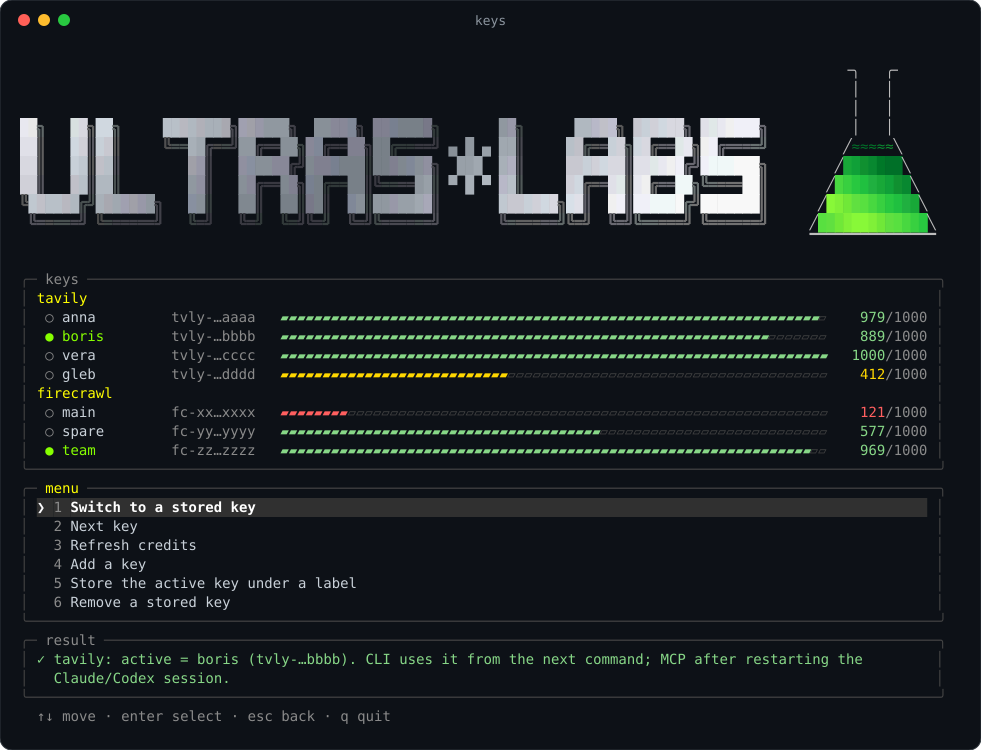

<p align="center">
  
</p>

<p align="center">
  <b>Переключатель API-ключей Tavily и Firecrawl для агентов и терминала</b><br>
  Кончились кредиты на одном ключе — одно нажатие, и Claude Code, Codex и CLI работают на другом.
</p>

<p align="center">
  <a href="https://github.com/Inhibit0r/keys/actions/workflows/test.yml"></a>
  
  
  
  <a href="LICENSE"></a>
</p>

<p align="center">
  
</p>

## Что это

У Tavily и Firecrawl бесплатный лимит на ключ. Если ключей несколько — свои, командные,
от друзей, — `keys` хранит их у вас на устройстве и делает активным нужный: записывает его
туда, откуда его читают MCP-серверы агентов и CLI.

- **TUI** — `keys` без аргументов: стрелки, подсветка, остаток кредитов каждого ключа
  шкалами, серебряная заставка ULTRAS\*LABS. Окно без фокуса не тратит CPU.
- **CLI** — `keys use tavily boris`, `keys next firecrawl`, `keys check --all`:
  для скриптов, хуков и самих агентов.
- **Один файл** на стандартной библиотеке Python. Ничего не ставит, ничего не отправляет,
  кроме запроса кредитов в API самих Tavily и Firecrawl.

## Установка

**macOS / Linux**

```sh
curl -fsSL https://raw.githubusercontent.com/Inhibit0r/keys/main/install.sh | sh
```

**Windows** (PowerShell)

```powershell
irm https://raw.githubusercontent.com/Inhibit0r/keys/main/install.ps1 | iex
```

Установщик кладёт `keys.py` в `~/.local/share/keys`, команду `keys` в `~/.local/bin`,
а на macOS/Linux добавляет в `~/.zshenv`, `~/.bashrc` или `~/.profile` подгрузку
активных ключей. Повторный запуск безопасен и обновляет `keys`. Откройте новый терминал.

## Подключение к агентам

MCP-серверы берут ключ из переменных `TAVILY_API_KEY` и `FIRECRAWL_API_KEY`, а их
выставляет `keys`.

**Claude Code** — одинарные кавычки обязательны: `${...}` раскрывает сам Claude Code.

```sh
claude mcp add -s user -t http tavily https://mcp.tavily.com/mcp -H 'Authorization: Bearer ${TAVILY_API_KEY}'
claude mcp add -s user -t http firecrawl https://mcp.firecrawl.dev/v2/mcp -H 'Authorization: Bearer ${FIRECRAWL_API_KEY}'
```

**Codex** — в `~/.codex/config.toml`:

```toml
[mcp_servers.tavily]
url = "https://mcp.tavily.com/mcp"
bearer_token_env_var = "TAVILY_API_KEY"

[mcp_servers.firecrawl]
url = "https://mcp.firecrawl.dev/v2/mcp"
bearer_token_env_var = "FIRECRAWL_API_KEY"
```

Если стоит `firecrawl` CLI, `keys use` обновляет и его `credentials.json`.

## Ключи

Добавляйте ключи сами, в своём терминале: ввод скрыт, ключ не попадает ни в историю
команд, ни в чат с агентом.

```sh
keys                      # TUI → «Add a key»
keys add tavily main      # то же из CLI: метка main, ключ вводится скрыто
```

| Команда | Что делает |
|---|---|
| `keys` | TUI |
| `keys list [service]` | метки и маскированные ключи, `*` — активный |
| `keys add <service> <label>` | сохранить ключ; первый ключ сервиса сразу активен |
| `keys import <service> <label>` | сохранить уже активный ключ под меткой |
| `keys use <service> <label>` | сделать ключ активным |
| `keys next <service>` | следующий ключ по кругу |
| `keys remove <service> <label>` | забыть ключ (активный остаётся активным) |
| `keys check [service] [--all]` | остаток кредитов |

`service` — `tavily` или `firecrawl`. CLI видит новый ключ со следующей команды,
MCP — после перезапуска сессии Claude Code или Codex.

<details>
<summary><b>TUI: клавиши</b></summary>

| Клавиша | Действие |
|---|---|
| `↑` `↓` / `k` `j` | выбор |
| `Enter` / `→` | открыть |
| `Esc` / `←` / `0` | назад |
| `1`…`9` | сразу пункт по номеру |
| `q`, `Ctrl-C` | выход |

`KEYS_NO_SPLASH=1` отключает заставку.
</details>

## Где что лежит

| Путь | Что | Права |
|---|---|---|
| `~/.config/api-keys/<service>` | ваши ключи, `label=key` построчно | `600` |
| `~/.config/<service>/env` | активный ключ: `export ..._API_KEY=...` | `600` |
| пользовательские переменные Windows | активный ключ (только Windows) | — |

`keys` никогда не синхронизирует ключи и не переключает их сам. Ключ проверяется
регулярным выражением перед записью: в файл, который читает оболочка, не попадёт ничего,
кроме символов ключа.

## Разработка

```sh
python3 -m unittest discover tests
```

Issues и pull requests приветствуются. Правило одно: только стандартная библиотека
и один файл `keys.py`. Об уязвимостях — по [SECURITY.md](SECURITY.md).

## Лицензия

[Apache-2.0](LICENSE)
